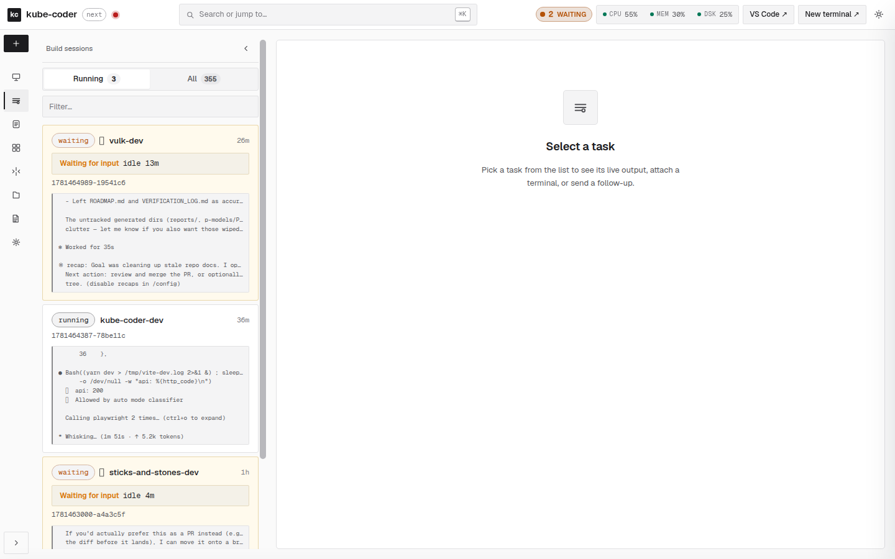
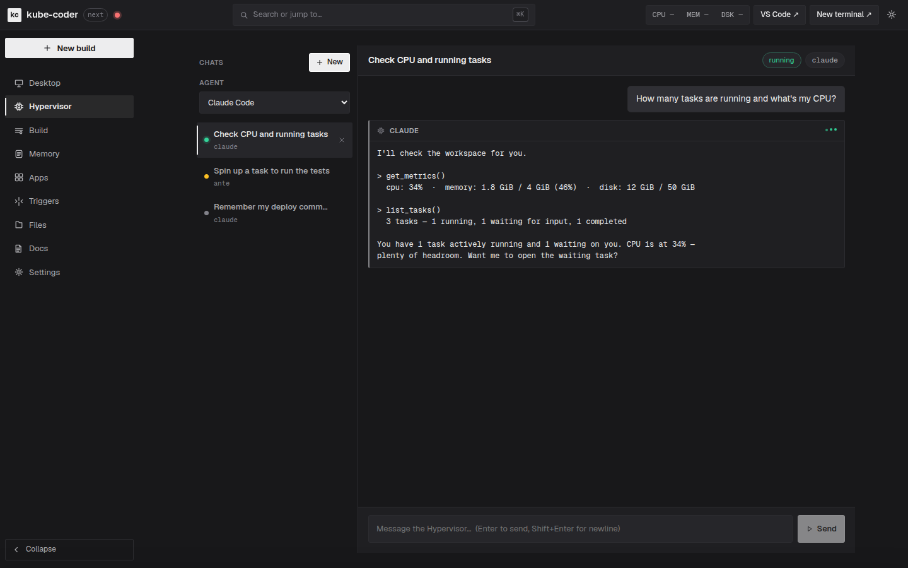
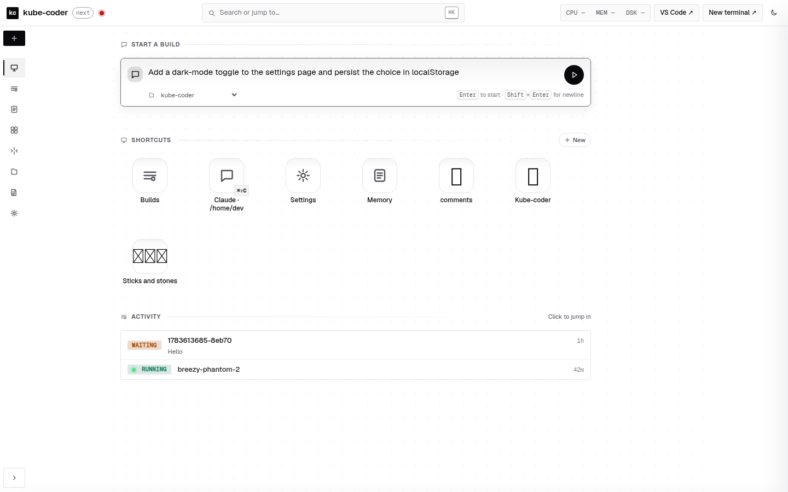

[](LICENSE)
[](https://helm.sh)
[](https://kubernetes.io)
[](https://github.com/imran31415/kube-coder/actions/workflows/ci.yml)
[](https://github.com/imran31415/kube-coder)
[-brightgreen)](https://github.com/imran31415/kubecoder-bench)

---


<h1>kube-coder</h1>

**One Helm chart turns a Kubernetes cluster into a fleet of AI-native cloud dev workspaces.**

[KubeCoder.com](https://kubecoder.com/) · [Docs & public demo](https://demo-public.dev.scalebase.io/docs) · [Benchmark](https://github.com/imran31415/kubecoder-bench) · [r/kubecoder](https://www.reddit.com/r/kubecoder/)

---

## The idea

Give every developer — or every AI agent — a real computer in the cloud, and make spinning one up a two-minute, self-service action.

Each **kube-coder workspace** is an isolated pod with a persistent home directory and everything a developer needs, reachable from any browser behind your own GitHub login:

- **VS Code** in the browser (`code-server`)
- a **persistent tmux terminal** that keeps running when you close the tab
- an **in-pod Chrome** you can watch over VNC (for previewing web apps, or letting an agent drive a browser)
- a **dashboard** that ties it together — and a **Hypervisor** chat that operates the pod *for* you
- **pluggable coding agents** — Claude Code, Codex, Gemini, Ante, OpenCode — that you can spawn, message, and fan out in parallel

Because it's just Kubernetes underneath, a single chart deploys as many of these as your cluster can hold — each with its own namespace, ingress, TLS certificate, persistent volume, and OAuth allowlist. Onboarding a new teammate is a form in the admin console; their workspace resolves and issues its own TLS on first request.

> **The short version:** it's a self-hosted, multi-tenant, AI-first replacement for "here's a laptop, spend two days setting it up." The environment survives restarts, an in-flight agent keeps working after you disconnect, and you can drive the whole thing from your phone.

---

## Proven on real tasks

kube-coder isn't a demo — the agents inside it solve real problems, and there's a public benchmark to show it.

[**kubecoder-bench**](https://github.com/imran31415/kubecoder-bench) runs coding agents against the [Aider polyglot](https://github.com/Aider-AI/polyglot-benchmark) (Exercism) suite, **scored against hidden tests** — a pass means the agent genuinely solved the task, not that it memorized the answer. Every task runs in its own isolated kube-coder workspace, fanned out across parallel workers.

| Backend | Python split (34 tasks) | Notes |
|---|---|---|
| **Oracle** (reference solutions) | **34 / 34** | validates the harness end-to-end |
| **Claude Code** | **27 / 34 — 79.4%** | single attempt, **no retries**; **~5.3× faster** via parallel workspaces |
| **Ante** (DeepSeek/OpenRouter) | runnable ✓ | agent-agnostic — swap one flag |

The 79.4% is a *conservative floor*: public leaderboards allow multiple attempts, this run allows one. The point isn't a headline number — it's that **the same infrastructure this repo ships parallelizes real agent work across isolated environments and validates it honestly.**

```bash
git clone https://github.com/imran31415/kubecoder-bench && cd kubecoder-bench
./setup.sh
python3 harness/bench.py --lang python --backend claude --workers 6
```

---

## See it

<table>
  <tr>
    <td width="50%" valign="top">
      
      <br/><sub><b>Fullstack Python</b> — split-pane editor with live terminal</sub>
    </td>
    <td width="50%" valign="top">
      
      <br/><sub><b>Fullstack Go</b> — split-pane editor with Claude Code</sub>
    </td>
  </tr>
  <tr>
    <td width="50%" valign="top">
      
      <br/><sub><b>Agent + app side by side</b> — an agent working next to its live UI</sub>
    </td>
    <td width="50%" valign="top">
      
      <br/><sub><b>Build sessions</b> — every agent session, with live output inline</sub>
    </td>
  </tr>
</table>

▶️ **Videos:** [new-user provisioning](#videos) · [product demo](#videos) · [marketing](#videos)

---

## The Hypervisor — talk to your workspace, and it acts



The **Hypervisor** is the feature that makes a kube-coder pod feel alive. It's a chat tab where you talk to the workspace in plain language and it *does the thing*:

> *"How many tasks are running and what's my CPU?"* · *"Spin up a build to run the tests."* · *"Remember that I deploy with `make ship`."* · *"Pin port 3000 to Apps."*

Under the hood it's not a screen-scraped terminal — each thread is a **structured agent session**. Your chosen CLI (Claude, Codex, Ante, …) runs headless over pipes, and a canonical event stream renders clean prose plus expandable tool cards. It's wired to three MCP servers so it can genuinely operate the pod:

- **dashboard** — read metrics/tasks/health, create & message builds, pin apps, manage memory
- **memory** — persistent facts about you and your projects
- **agent-orchestrator** — spawn and coordinate sub-agents

Destructive actions (`kill_task`, `delete_memory`) ask for confirmation right in the chat. It's fully mobile, works with whichever assistant you pick, and survives pod restarts (the Claude adapter `--resume`s its session). See [`docs/hypervisor-spec.md`](docs/hypervisor-spec.md) for the architecture.

---

## Build sessions & parallel agents

A **build session** is an interactive Claude / Codex / Ante / OpenCode tmux session inside the pod. Start one from the dashboard, the phone app, or the API; it survives restarts, and its output is mirrored to a log you can tail from anywhere.

The **New build** flow is deliberately minimal — pick an assistant + working directory, get a memorable name (`funny-kitty-37`), and land straight in a live terminal. No prompt box to fill out first; type your first prompt in the REPL, like you would locally.

**Parallelism is the point.** The built-in **agent-orchestrator** MCP lets any session spawn sub-agents — across *different* harnesses — to fan work out and collect results:

```
spawn_agent("Refactor module A", assistant="ante")     → task_1
spawn_agent("Write tests for module C", assistant="claude") → task_2
wait_for_agent(task_1); wait_for_agent(task_2)         → synthesize
```

Guardrails (max spawn depth, max concurrent agents) keep a runaway loop from fork-bombing the pod.

### API

```bash
# POST /api/claude/tasks  (oauth2 headers OR Authorization: Bearer <token>)
curl -s https://<user>.dev.example.com/oauth/api/claude/tasks \
  -H 'Content-Type: application/json' \
  -d '{"prompt": "review this PR", "assistant": "claude"}'
```

| Endpoint | Purpose |
|---|---|
| `POST /api/claude/tasks` | Create a build (prompt optional) |
| `GET  /api/claude/tasks` | List sessions |
| `GET  /api/claude/tasks/{id}` | Detail |
| `GET  /api/claude/tasks/{id}/output` | Tail the tmux pane |
| `GET  /api/claude/tasks/{id}/stream` | SSE live stream |
| `POST /api/claude/tasks/{id}/message` | Send a follow-up prompt |
| `DELETE /api/claude/tasks/{id}` | Kill the tmux session |

Full reference: [`docs/claude-task-api.md`](docs/claude-task-api.md). There's also a `/remote-task` skill to dispatch a prompt from a lighter workspace to a stronger one and stream the result back.

---

## What's in a workspace

Every workspace exposes the same set of surfaces, all behind a single GitHub OAuth login:

| Surface | What it is | Access URL |
|---|---|---|
| **Dashboard SPA** | Vite + Preact app: Desktop, Hypervisor, Build, Memory, Triggers, Apps, Skills, Files, Settings | `/` |
| **Hypervisor** | Chat that reports live state and acts on the pod | `/` → Hypervisor |
| **Terminal** | ttyd-attached tmux, reachable from any browser | `/oauth/terminal/` |
| **VS Code** | `code-server` rooted at `/home/dev` | `/oauth/vscode/?folder=/home/dev` |
| **In-pod browser** | Chrome on a virtual X display, viewed via noVNC | `/oauth/vnc-direct/vnc.html` |
| **Metrics + health** | Live CPU / Mem / Disk + service health | `/oauth/metrics`, `/oauth/health` |
| **Assistants** | Claude Code, Codex, Gemini, Ante, OpenCode, LibreFang | per-session |

### The dashboard



The dashboard at `/` is a single Preact app:

- **Desktop** — your workspace home: a top-of-page composer to start a build in one line, pinned shortcuts, and recent activity.
- **Build** — live + past agent sessions on the left, a detail pane on the right with **Terminal**, **Preview** (split ttyd ┃ noVNC), **Send message** (chat mirror of the tmux pane, with image paste), **Info**, and **Subagents** tabs.
- **Memory** — persistent, SQLite-backed memory with history + relations, mirrored over MCP.
- **Triggers** — webhooks + cron jobs that spawn builds on a schedule or an inbound POST.
- **Apps** — pin a running port (e.g. `:3000`) to preview your app inside the dashboard.
- **Skills** — browse and sync `SKILL.md` files across every harness in the pod.
- **Files** — read the PVC, upload files, make directories.
- **Settings** — appearance, GitHub identity, subscription logins, browser/VNC controls, and real-time metrics with alerts.

A persistent top bar shows live CPU/mem/disk and one-click VS Code + New-terminal buttons. **It's fully responsive** — below 720px the rail collapses to a bottom nav, the detail pane becomes a swipeable sheet, and the layout re-flows for touch.

---

## Persistent memory

Every workspace has a SQLite-backed memory store — facts about you, your projects, and your conventions — reachable three ways:

- **Dashboard → Memory** (CRUD with history + relations)
- **MCP server** auto-spawned for every agent (read + write from inside the assistant)
- **REST** at `/api/memory`

Agents read it on demand; optional pre-injection (`KC_MEMORY_PREINJECT=1`, off by default) prefixes a new build's prompt with the most relevant records. It's how the Hypervisor "remembers that I deploy with `make ship`" and how a fresh session already knows your setup. Deep dive: [`docs/persistent-memory.md`](docs/persistent-memory.md).

---

## Triggers — webhooks, crons, completion hooks

Three ways to start a build without clicking **New build**:

1. **Completion hooks** — fire a webhook when an agent finishes (status, output URL, summary).
2. **Webhooks** — accept inbound POSTs and turn the body into a build prompt via a template.
3. **Crons** — UNIX cron expressions that POST to a webhook on a schedule.

All three live under **Triggers**, and what-fired-what is tracked in the memory store.

---

## Pluggable AI assistants

Every session — and every orchestrator sub-agent — picks its assistant at create-time, so you can mix them freely in one workspace. Keys live in `users-private/<name>/secrets/assistant.yaml` (gitignored); the public defaults are empty, so it ships Claude-only out of the box, and users can add their own provider keys self-service from **Settings**.

| Assistant | Backend | Configure with |
|---|---|---|
| **Claude Code** (default) | Anthropic API key or subscription login | `claude.apiKey`, or `make shell USER=<name>` → `claude` to log in once |
| **Codex** | OpenAI's terminal agent; ChatGPT OAuth (no API key) | `codex login` once in the pod |
| **Google Gemini** | Google's `gemini` CLI (default `gemini-2.5-pro`) | `assistant.gemini.apiKey` |
| **Ante** | Antigma's terminal agent; defaults to **DeepSeek v3.2 via OpenRouter** | `assistant.openrouter.apiKey` (CLI pre-installed) |
| **OpenCode → OpenRouter** | any OpenRouter model | `assistant.openrouter.apiKey` + `model` |
| **OpenCode → DeepSeek** | DeepSeek native API | `assistant.deepseek.apiKey` |
| **LibreFang** | open-source agent OS; reuses set provider keys | `assistant.librefang.agent` |

### A "Claude-like" agent without an Anthropic key — Ante + DeepSeek

Pair the [**Ante**](https://ante.run/) CLI — pre-installed in every workspace — with **DeepSeek** and you get a Claude-Code-style experience: autonomous multi-step edits, shell/file tools, and the **same MCP memory + orchestrator servers** Claude uses, at a fraction of the cost. Set `OPENROUTER_API_KEY` and Ante defaults to `deepseek/deepseek-v3.2` (~$0.23 / $0.34 per 1M in/out tokens) — cheap enough to be the default background sub-agent in the orchestrator.

---

## Mobile app (iOS & Android)


Beyond the responsive web dashboard, kube-coder ships a native **Expo / React Native app** ([`mobile/`](mobile/)) to drive your workspace from your phone: list / create / message / kill agent sessions, tail their **color terminal output** with a control-key bar (Shift-Tab, Esc, arrows, Ctrl-C, Paste), chat with the **Hypervisor**, attach photos to a follow-up, search memory, and watch live metrics — all over the workspace's Bearer-token API. It points at **any** kube-coder host: a cloud workspace, or a local minikube one via `make mobile-forward`.

```bash
cd mobile && npm install
npm run ios          # iOS Simulator   (or: npm run android / npm run web)
```

Enter your **workspace host** + **API token** (copy both from **Settings → Mobile app**) on the first screen. Store builds use EAS — no Mac needed:

```bash
make mobile-build         # EAS cloud build (iOS .ipa + Android .aab)
make mobile-screenshots   # regenerate App Store / Play Store screenshots
```

Full walkthrough: [`mobile/README.md`](mobile/README.md).

---

## Quick start

kube-coder runs two ways — pick the one that fits:

| | **Local (minikube)** | **Cloud / multi-tenant** |
|---|---|---|
| Best for | trying it out, dev, offline | real deployments, teams |
| Needs | Docker + minikube | a cluster, registry, DNS, GitHub OAuth |
| Auth | http basic (`admin`/`admin`) | GitHub OAuth2 (or basic) |
| TLS | none (plain HTTP, localhost) | cert-manager + Let's Encrypt |
| Guide | [Option A](#option-a--local-minikube) + [docs/local-development.md](docs/local-development.md) | [Option B](#option-b--cloud--multi-tenant) + [docs/NEW_USER_PROVISIONING.md](docs/NEW_USER_PROVISIONING.md) |

> **📖 Follow-along walkthroughs:**
> - [Getting started on a MacBook with minikube](docs/getting-started-minikube-macos.md) — clean laptop → local dashboard
> - [Deploying on Kubernetes (multi-tenant, OAuth + TLS)](docs/deploy-on-kubernetes.md) — cluster → per-user workspace

### Option A — Local (minikube)

Run the whole stack on a local single-node cluster — no cloud account, registry, DNS, or TLS.

**Prerequisites:** Docker, minikube, kubectl, helm (`brew install minikube kubectl helm` on macOS).

```bash
make local          # start minikube, build the image, deploy, and print access info
```

**Then reach the dashboard:**

```bash
echo '127.0.0.1  kube-coder.local' | sudo tee -a /etc/hosts   # one time
make local-forward                                            # keep running in a terminal
# open http://kube-coder.local:8080/   →   basic auth: admin / admin
```

`make local` wraps steps that each run on their own (`local-up`, `local-build`, `local-secret`, `local-deploy`, `local-info`, `local-down`). Everything targets the minikube context explicitly, so it never touches a remote cluster. Full guide: [docs/local-development.md](docs/local-development.md).

### Option B — Cloud / multi-tenant

**Prerequisites:** Kubernetes 1.19+, Helm 3.0+, an nginx-ingress controller, **wildcard DNS** (`*.<your-domain>` → the ingress IP), a GitHub OAuth App for the controller console, a private GitHub repo as the GitOps config store, and a `regcred` image-pull secret.

```bash
make deploy-base                  # base infra: nginx-ingress, oauth2-proxy, cert-manager
make ship-controller-config       # the admin console (workspace-controller)
```

Two things make self-service onboarding work; you set them once:

- **Wildcard DNS** — point `*.<your-domain>` at your ingress IP. Every workspace lives at `<github-login>.<your-domain>`, so a new user's host resolves the moment they're created, and **cert-manager + Let's Encrypt** issues its TLS cert on first request.
- **The console's GitHub OAuth App + admin allowlist** — gates the dashboard at `controller.<your-domain>`; only allowlisted logins may administer workspaces. One-time config: [docs/PROVISIONING.md](docs/PROVISIONING.md).

#### Onboard a user — the 2-minute dashboard flow

> **Scenario.** Dana (`@dana-codes`) joins Monday morning and needs a full cloud workspace before standup.

1. **Open the console** at `https://controller.<your-domain>` → **New workspace**.
2. **Look up the user** — type `dana-codes`, hit **Look up**. The controller confirms it's a real GitHub account and shows the host: `dana-codes.<your-domain>`.
3. **Create a GitHub OAuth App** — the one manual step (GitHub has no API for it). The form shows the exact Homepage + callback URLs.
   > ⚠️ It must be an **OAuth App** (Client ID starts with `Ov…`), *not* a GitHub App (`Iv…`), which silently 404s the login.
4. **Paste & create** — drop the Client ID + Secret into the form → **Create workspace**. The controller commits Dana's config to your GitOps repo and launches a provisioner Job; the page streams the rollout: *Starting → Deploying → **Workspace ready***.
5. **Hand it off** — send Dana `https://dana-codes.<your-domain>`. She signs in with her own GitHub account (she, and only she, is on the allowlist) and lands in VS Code, a terminal, and Claude Code. Elapsed time: a couple minutes, most of it the image pull.

#### Manage a user — limits, updates, lifecycle


All per-workspace, in the same console:

- **Right-size resources** — **Edit limits** → set CPU / memory. Applying patches the live pod **and** commits the new limits to GitOps, so it's durable across redeploys. Live usage + estimated monthly cost sit right above the control.
- **Keep them current** — each workspace shows its release and an **update** action; users can also self-update from their own dashboard.
- **Pause to save spend** — **Stop** scales the pod to zero (PVC preserved); **Start** brings it back unchanged.

#### Automation / break-glass: the CLI

The same workspaces are fully operable from the Makefile — for scripting, CI, or when the console is down. Config lives in the GitOps repo; `make users-sync` checks it out locally so CLI and console share one source of truth:

```bash
make users-sync                   # pull the GitOps config store into .users/
make new-user      USER=<name>    # scaffold a workspace (prints the OAuth-App checklist)
make deploy        USER=<name>    # helm upgrade --install
make logs|shell|test USER=<name>  # operate a running workspace
make stop|start    USER=<name>    # scale to zero / back
```

Full CLI walkthrough: [docs/NEW_USER_PROVISIONING.md](docs/NEW_USER_PROVISIONING.md).

---

## Architecture

```
   ┌──── browser ────┐
   │                 │ ───► oauth2-proxy ───► nginx-ingress ───► ws-<user> Service
   └────────────────┘                                                  │
                                                                       ▼
                                                        ┌── ws-<user> Pod ──┐
                                                        │  server.py (8080) │
                                                        │  code-server      │
                                                        │  ttyd  (7681)     │
                                                        │  novnc (6081)     │
                                                        │  Chrome + Xvfb    │
                                                        │  tmux sessions    │
                                                        └───────────────────┘
```

A per-user PVC mounted at `/home/dev` survives pod restarts; the tmux sessions attached to it survive too, so an in-flight agent build keeps running even after you close the tab. `oauth2-proxy` injects `X-Auth-Request-User` on every `/oauth/*` route; each workspace's proxy is pinned to exactly one GitHub login.

### Repository layout

```
charts/
├── base-infrastructure/   # ingress, oauth2-proxy, cert-manager
└── workspace/             # per-user workspace chart
    ├── server.py          # API + dashboard backend (tmux, memory, metrics, hypervisor)
    ├── hypervisor_session.py  # structured agent-session runner + per-CLI adapters
    ├── mcp_dashboard.py   # dashboard MCP server (read/act on the pod)
    └── web/               # Vite + Preact SPA (the dashboard at /)
        ├── src/routes/    # desktop, hypervisor, tasks, memory, triggers, apps, skills, files, settings
        ├── src/store/     # signals: tasks, ui, metrics, router
        └── scripts/shoot.mjs   # playwright screenshots
deployments/               # public sample per-user values.yaml + secrets
users-private/             # gitignored; controller bootstrap config
mobile/                    # native Expo / React Native app (iOS + Android, EAS builds)
devlaptop/Dockerfile       # the workspace image (SPA baked into /opt/dashboard-dist)
Makefile                   # all common commands (`make help`)
```

---

## Pre-installed stack

| Component | Version |
|---|---|
| Node.js | 20 LTS |
| `code-server` (VS Code) | v4.x |
| Claude Code CLI | 2.1.174 |
| Codex CLI | 0.144.3 |
| OpenCode CLI | 1.17.4 |
| Ante CLI | stable channel |
| LibreFang | 2026.x beta |
| ttyd | 1.7.7 |
| tmux, yarn, gh, jq, ripgrep, fzf | latest from Ubuntu |

Bump versions in `devlaptop/Dockerfile` and run `make push` to rebuild.

---

## Common commands

```bash
# Docker image
make build / make push / make clean

# Per-user lifecycle
make deploy   USER=<name>         # helm upgrade --install
make ship     USER=<name>         # build + push + roll the pod
make rollback USER=<name>         # helm rollback
make logs|shell|test USER=<name>  # operate a running workspace

# Dashboard SPA
make dashboard-web                # type-check + vite build → web/dist
make dashboard-web-test           # vitest unit tests

# Tests across the repo
make test-all-units               # SPA (vitest) + server.py (unittest)
make coverage                     # HTML coverage reports

# Cluster status
make status                       # helm + pod status
```

`make help` (or just `make`) lists everything with one-line descriptions.

---

## Testing & code quality

| Component | Coverage | Framework |
|---|---|---|
| **Frontend (Dashboard)** | 41.6% | Vitest + @testing-library |
| **Backend (Python API)** | 74% | unittest + coverage.py |
| **Overall** | 60% | statement-weighted average |

```bash
make test-all-units    # SPA + Python unit tests (run before every PR)
make coverage          # HTML reports → web/coverage/ and htmlcov/
```

All tests run automatically on GitHub Actions.

---

## Development

```bash
# Run the SPA locally against a built dist with auth bypassed
make dashboard-web
DASHBOARD_DIST_DIR=$(pwd)/charts/workspace/web/dist \
  python3 charts/workspace/web/dev_server.py
# → http://127.0.0.1:7070
```

Pull requests welcome — please run `make test-all-units` and keep coverage healthy before opening a PR. Contribution guide: [CONTRIBUTING.md](CONTRIBUTING.md).

---

## Acknowledgments

kube-coder stands on excellent open source:

- **[Kubernetes](https://kubernetes.io)** + **[Helm](https://helm.sh)** — orchestration & deployment
- **[NGINX Ingress](https://kubernetes.github.io/ingress-nginx/)** + **[oauth2-proxy](https://github.com/oauth2-proxy/oauth2-proxy)** — routing & auth
- **[VS Code / code-server](https://github.com/coder/code-server)**, **[tmux](https://github.com/tmux/tmux)**, **[ttyd](https://github.com/tsl0922/ttyd)**, **[noVNC](https://novnc.com/)** + **[Xvfb](https://www.x.org/)** — the dev surfaces
- **[Claude Code](https://code.anthropic.com/)**, **[Codex](https://github.com/openai/codex)**, **[OpenCode](https://opencode.ai/)**, **[Ante](https://ante.run/)** — the coding agents
- **[Preact](https://preactjs.com/)** + **[Vite](https://vitejs.dev/)** + **[Playwright](https://playwright.dev/)** — the dashboard & its screenshots

---

## Videos

| | |
|---|---|
| **New-user provisioning** | https://github.com/user-attachments/assets/d9e6c19c-28ab-4f5e-963a-08b1d0a7085a |
| **Marketing** | https://github.com/user-attachments/assets/1e4d1bd5-ec9c-4f4e-88ba-7c2b79593a4c |
| **Demo** | https://github.com/user-attachments/assets/f5821e5c-a834-4db2-a34d-2d405c3daef2 |


---

## Contact

Interested in a demo, an enterprise deployment, or a custom integration?
**scalebaseio@gmail.com** · [KubeCoder.com](https://kubecoder.com/) · [r/kubecoder](https://www.reddit.com/r/kubecoder/)

## License

MIT — see [LICENSE](LICENSE).
