# Board Processor (`/board`)

Work items from a tracker **this workspace does not own** — a Jira project, a
GitHub repo's issues, a Linear team, a Zendesk queue — through a connector that
is data rather than code.

Chat's AI CTO mode answers *"what should we work on?"*. The Board Processor answers
*"here is a board someone else is tracking — go work it."* It is the first
surface that acts on a system kube-coder does not own, which is why most of its
design is about safety and honesty rather than throughput.

> **Phases 1–7 have shipped.** You can connect a board from a starter
> template in the UI — pick a vendor, paste a credential, watch it fetch —
> read it, run many
> items in parallel without working any of them twice, have the agents propose
> writes instead of making them, approve / reject / edit those from the desktop
> or a phone, and **send one back with a question so the agent resumes with its
> prior context**. Selection strategies, starter connector templates and
> per-board approval-rate metrics are in. Mobile **push** now delivers the
> high-signal items (an agent waiting on you, a decision) to the phone.

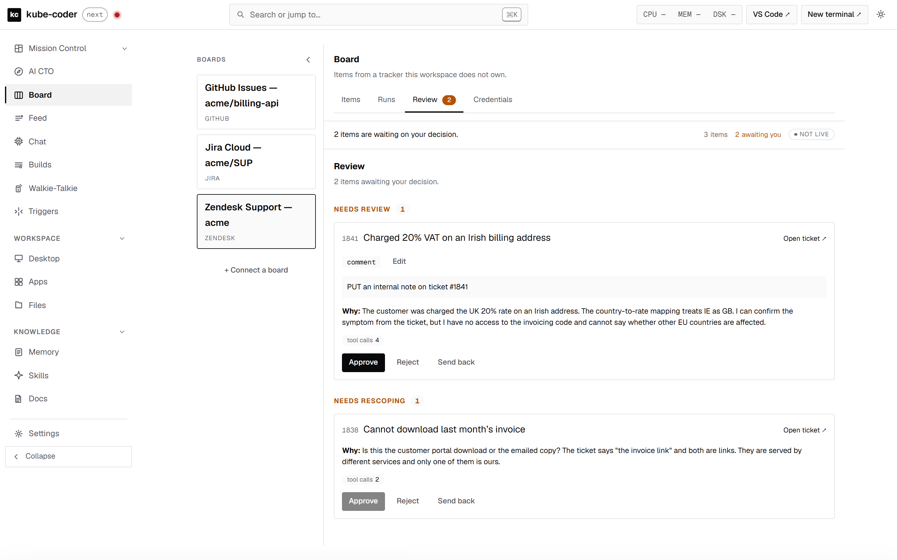

The rail holds three boards on three different vendors — a GitHub repo, a Jira
project and a Zendesk queue — and the surface is the same for all of them,
because a connector is data. The review queue is the part worth looking at
twice: every card is a write an agent wanted to make and **has not made**.

More in [`screenshots/board-processor/`](screenshots/board-processor/) — the
whole connect flow screen by screen (`board-connect-*`, walked through
[below](#connecting-a-board)), the items list with vendor statuses normalized
(`board-items`), a run with its selection strategy and the "what would this
work?" preview (`board-runs`, `board-preview`), a run **mid-flight** with live
work sorted to the top of its item table, a View session link per Build and
outcomes that open their review card (`board-run-live`), the card that opens
when you click one (`board-review-focused`), the credential store that never
shows a value (`board-credentials`), and the review queue on a phone
(`board-review-mobile`). Regenerate with
`node scripts/shoot-board.mjs <out-dir>` from `charts/workspace/web`.

---

## Connecting a board

**Board → + Connect a board.** Pick GitHub Issues, Jira Cloud or Zendesk, fill
in the two or three things a template cannot know about you, paste the
credential, and it fetches once before calling itself connected.

A workspace with no boards, and the button that fixes that:

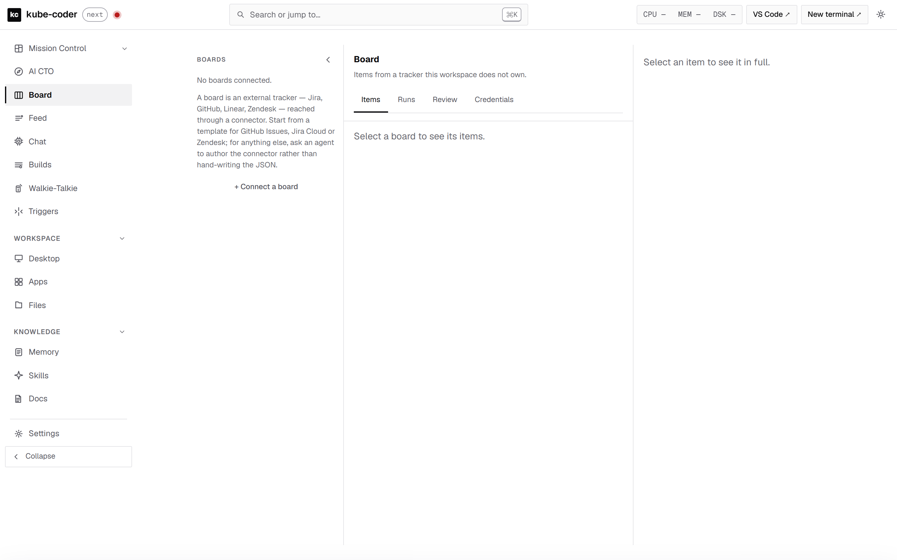

The picker. Three templates, each a connector already written against the
vendor's real API — GitHub's `Link` pagination and its `state`+`state_reason`
composite, Jira's two-step transition, Zendesk's `next_page` and its per-ticket
write cap:

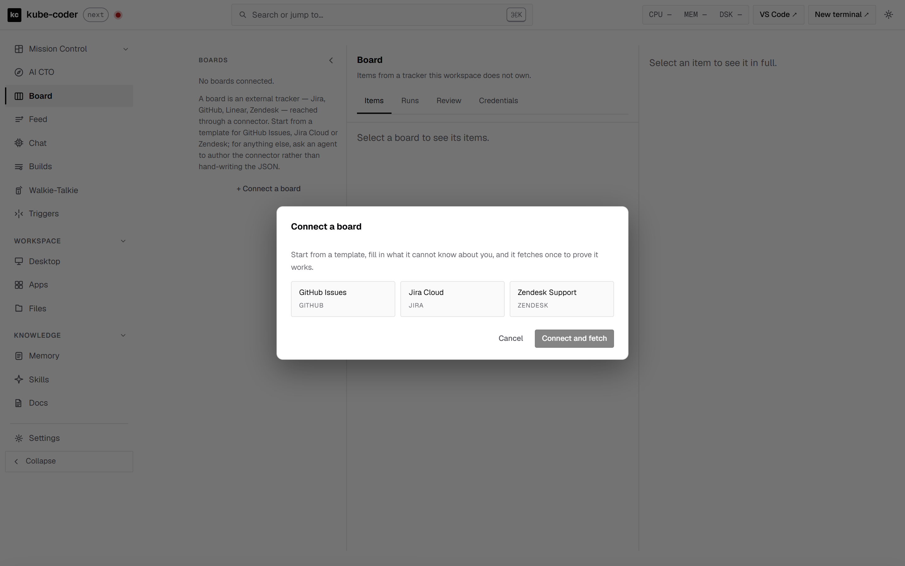

Pick one and the form is built from that template's own `placeholders` and
`credential` blocks. **GitHub asks for no secret at all** — the workspace
brokers its own App token, and saying so is better than an empty box someone
hunts for a value to put in:

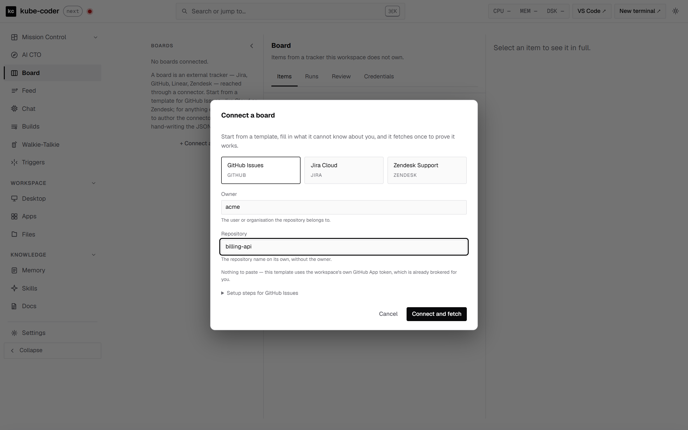

**Jira composes Basic**, so the same form grows a username field. Nothing in
the browser is switch-cased per vendor; the difference comes from the
connector's own `auth` block, which is why the form cannot drift into asking
for the wrong shape:

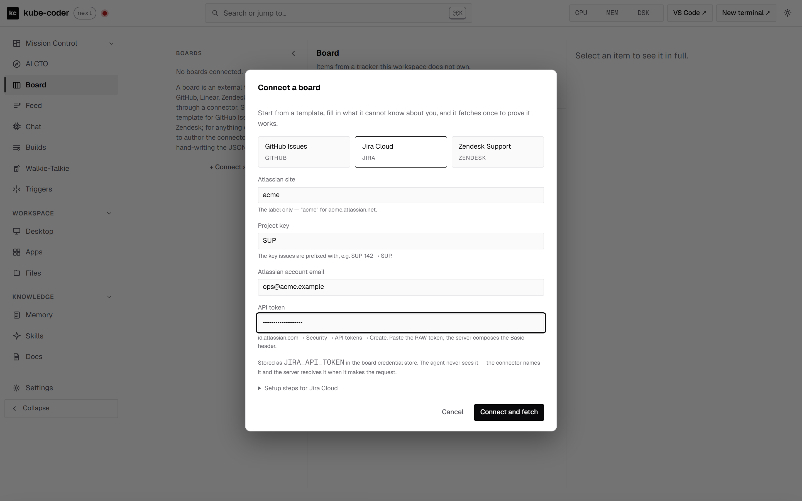

**Zendesk's setup steps travel with the template**, because minting its
credential is a browser flow rather than a settings page, and the step that
matters most is the one warning you off what every integration guide still
shows:

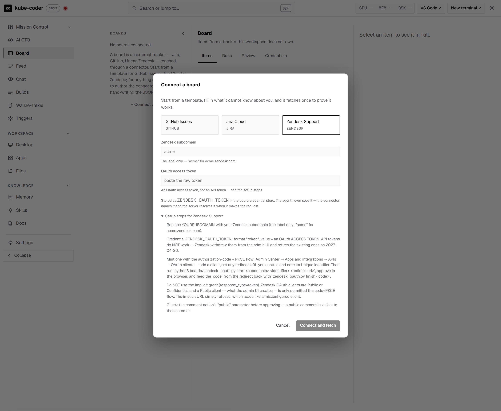

Then it fetches. **This is the screen that matters**, because it is the
difference between a board that has been saved and a board that has
demonstrated something:

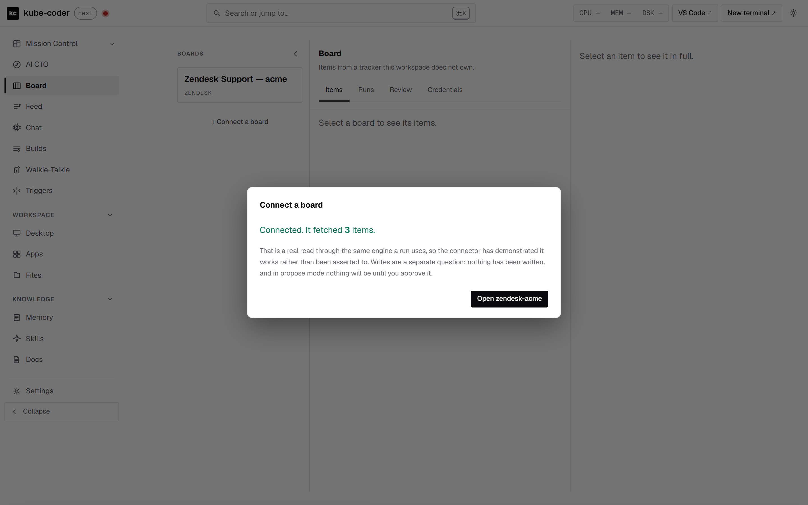

And when it does not fetch, the board is **kept**, not rolled back — the
connector is usually right and the credential wrong, and discarding it makes
you retype every answer to find out which:

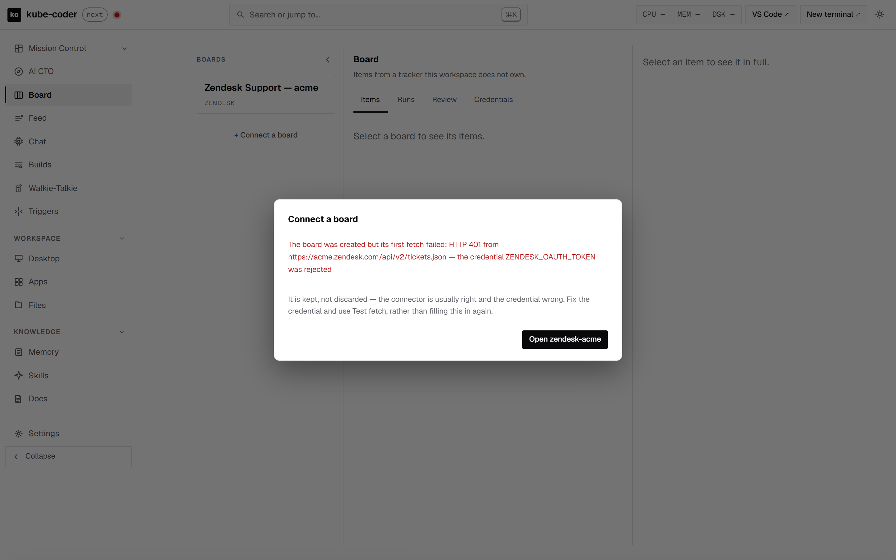

The same dialog on a phone (`board-connect-mobile`), since the review queue is
already a phone surface and connecting should not be the one step that demands
a desktop.

Three details in there are deliberate rather than incidental:

**The form is generated from the template.** `GET /api/boards/templates`
returns each one's `placeholders` (the literal blanks — `OWNER`, `PROJ`,
`YOURSUBDOMAIN` — with a label and an example) and its `credential` block (the
name to store it under, and whether the connector composes Basic or sends a
bearer). Nothing in the browser is switch-cased per vendor, so a fourth
template is a change to `boards/templates.py` and nothing else. Two tests hold
the two halves together: every declared blank must exist in its connector, and
no connector may carry a blank nobody declared — an undeclared one is never
asked about and survives into a board that fetches from `OWNER/REPO`.

**Substitution happens on the server, in one pass.** `POST
…/templates/<id>/fill` does it, and the values are restricted to
`[A-Za-z0-9._-]`. That is not fussiness: these land inside URL paths and inside
Jira's JQL string, where `PROJ` = `X ORDER BY created` is not an error but a
valid query against somebody else's project. There is no way to escape a value
for a URL segment and JQL at once, so the restriction *is* the defence. One
pass, because two sequential replaces would substitute `OWNER` and then go
looking for `REPO` inside the text just inserted.

**It ends with `test-fetch`, and reports what came back.** A board that has
been saved has demonstrated nothing; a board that has fetched has. If the fetch
fails the board is **kept**, not rolled back — the connector is usually right
and the credential wrong, and discarding it makes you retype every answer to
find out which.

Zendesk needs one step outside the UI, because minting its credential is a
browser flow rather than a settings page: `python3 boards/zendesk_oauth.py
start <subdomain> <client-id> <redirect-url>`, approve, then `finish <code>`.
API tokens do not work — Zendesk withdrew them from the admin UI and retires
the existing ones on 2027-04-30 — and neither does the implicit grant every
integration guide still shows, because the admin UI creates **Public** clients
and a Public client is only permitted authorization-code + PKCE.

For a tracker with no template, ask an agent to author the connector
(`BOARD_GEN_PREAMBLE` governs that path) rather than hand-writing JSON. The bar
is the same either way: `test-fetch` plus one held write.

---

## Positioning

| Surface | What it is |
|---|---|
| Chat (Hypervisor) | Reactive assistant; operates this workspace |
| Chat in **CTO mode** | Strategy over **our** projects and decisions (#683 — it used to be its own `/cto` page) |
| Mission Control | What is running right now |
| **Board Processor (`/board`)** | Pulls items from an **external** board, works them, writes results back |

The unit of work is an item on someone else's board, and success means that
board changed.

---

## Architecture

Four invariants. Violate any one and the feature stops being safe:

1. **No new runner, and no LLM in the server.** Items are worked by the
   machinery that already exists — `HypervisorSession` for interactive work,
   `ClaudeTaskManager` Builds for autonomous. `server.py` stays deterministic:
   it fetches, normalizes, stores, schedules and serves.
2. **The connector is data, never code.** No `eval`, no plugin import, no
   generated Python. Genericity comes from a declarative adapter validated
   against a closed schema (`boards/schema.py`).
3. **An agent authors; deterministic code executes.** Authoring a connector is
   design-time and non-deterministic. Runtime is always deterministic — no
   model is ever in the path of a board fetch or write.
4. **One hardened outbound path.** Every URL — the list request, *every*
   pagination `next`, and *every* step of *every* action — goes through
   `safe_http`, the same guard the completion hook uses: public-address-only
   classification, single DNS resolution with connection pinning, and all
   redirects refused.

```
charts/workspace/
  safe_http.py        SSRF guard, shared with completion-hook delivery
  boards/
    schema.py         PURE  — connector validation, closed enums
    engine.py         PURE  — fetch / paginate / map / act (HTTP injected)
    limits.py         three-tier rate limiting
    runs.py           run state machine, leases, processed markers
    review.py         dispositions, staged actions, the approval guards
    store.py          IMPURE — atomic JSON records under a real flock
  server.py           BoardsManager · BoardCredentialsManager
                      BoardRunsManager · BoardReviewManager
  mcp_dashboard.py    list_boards / get_board_item / board_probe /
                      board_action / board_report
```

`engine.py` never imports `server` and reaches the network only through a
callable `BoardsManager.http_for()` hands it. That is what makes every
pagination edge case testable without a socket — and what makes it impossible
for a future code path in the engine to reach the network unguarded.

---

## The canonical item

```jsonc
{
  "id":   "46",                            // stable GLOBAL identity
  "key":  "5",                             // human / URL reference
  "ref":  { "project": "42", "iid": "5" }, // what action URLs interpolate
  "title": "...", "body": "...",
  "status":   { "normalized": "IN_PROGRESS", "raw": "In Review" },
  "priority": { "normalized": "HIGH",        "raw": "P2" },
  "assignee": { "id": "...", "name": "...", "email": "..." },
  "contact":  { "id": "...", "name": "...", "email": "..." },  // the customer
  "collection": { "id": "...", "name": "Support" },
  "tags": ["billing"],
  "url": "https://...",                    // deep link for the human reviewing
  "created_at": "...", "updated_at": "...",
  "raw": { }                               // FULL vendor object, always kept
}
```

**`id`, `key` and `ref` are three different things.** GitLab issues carry both
a global `id` (46) and a project-scoped `iid` (5); project 42 / id 46 / iid 5 is
fetched as `GET /projects/42/issues/5`. Conflating them makes processed-markers
collide across projects — a silent double-processing bug.

Normalized status is deliberately only `OPEN` / `IN_PROGRESS` / `ON_HOLD` /
`CLOSED`, and priority only `URGENT` / `HIGH` / `NORMAL` / `LOW`. An unmapped
vendor value passes through as `raw` rather than being coerced. A four-value
enum survives arbitrary vendor workflows precisely because it is small **and is
never the only copy of the truth**.

GitHub's `state_reason` is the test case: `closed+completed` and
`closed+not_planned` both normalize to `CLOSED` and differ only in `raw` — and
for a board processor that difference matters.

`contact` is first-class because customer-service boards are in scope; the
external requester is not a custom field.

---

## Pagination, and why `complete` exists

Five genuinely different regimes:

| `kind` | Vendor | Shape |
|---|---|---|
| `page_token` | Jira `/search/jql` | opaque `nextPageToken`, no total |
| `cursor` | Linear, Monday | cursor in the request **body**; expires |
| `next_url` | Zendesk | absolute `next_page` |
| `link_header` | GitHub | `Link: …; rel="next"` |
| `offset` | Asana, legacy Jira | `startAt` / `maxResults` |

Every fetch carries `complete: true|false`, and **absent metadata never means
complete**:

| Situation | Verdict |
|---|---|
| Terminator present | fetch the next page |
| Terminator absent, **short** page | `complete: true` |
| Terminator absent, **full** page | `complete: false`, `full_page_no_pagination_metadata` |
| Page limit reached | `complete: false`, `max_pages` |
| Cursor rejected mid-walk | `complete: false`, `cursor_expired` |

That third row is the whole point. Jira silently truncates a JQL query that
exceeds `maxResults` and no longer returns a total; GitLab omits
`X-Next-Page`/`X-Total-Pages` entirely under keyset pagination and above 10,000
records under offset pagination. A connector reading a missing header as "one
page" would silently truncate a 10,000-issue project.

Cursors expire, so a run cannot store one, pause and resume. Pagination
completes within a single pass; resumption re-queries from the top.

---

## Actions

A one-shot `{method, url, body}` cannot express Jira, and Jira is the board that
matters most. Changing a status means: `GET` the available transitions (the set
is status- *and* permission-dependent, so ids are not stable) → find the one
whose `to.name` matches → `POST` that id.

```jsonc
"set_status": {
  "params": { "status": { "type": "string", "required": true } },
  "writes": 1,
  "steps": [
    { "id": "t", "method": "GET",
      "url": "${base_url}/rest/api/3/issue/${item.ref.issue_key}/transitions?expand=transitions.fields" },
    { "method": "POST",
      "url": "${base_url}/rest/api/3/issue/${item.ref.issue_key}/transitions",
      "select": { "from": "t.transitions", "where": { "to.name": "${params.status}" }, "as": "tr" },
      "body": { "transition": { "id": "${tr.id}" } } }
  ]
}
```

`select` matches one element of a prior step's response by field value. Still
declarative — this is the minimum expressive power reality requires.

**The action list is the allowlist.** An agent invokes a *named* action with
parameters; it cannot construct an arbitrary HTTP request. Interpolation is
restricted to a closed token set (`${base_url}`, `${item.*}`, `${params.*}`,
`${<step_id>.*}`, `${marker}`) — there is no `${env.*}`, so a connector cannot
exfiltrate the pod environment into a query string.

Actions differ in natural idempotency: setting a status twice is harmless,
posting a comment twice is a visible mistake in front of a customer. Comment-type
actions embed a stable marker and probe for it before posting again.

---

## Rate limits

A single `requests_per_minute` is the wrong shape. Three tiers:

- **global** — per board
- **per_action** — Zendesk caps Update Ticket at 30 per 10 min *per user per
  ticket* while allowing far more reads
- **per_item_writes** — a distinct budget; comment + status + assign burns 3

Plus `Retry-After` / `ratelimit-reset` honouring, and **configurable limit
detection**: GitHub's secondary limits return status **200 or 403, not 429**, so
`limit_detect` takes both a status list and body phrases. A plain 403 without
the phrase stays a permission error — retrying one forever is its own outage.

Backoff is **global, not per-worker**: the budget is account-wide, so one worker
hitting a limit must pause the whole run.

---

## Credentials

A connector **never** contains a secret. It names one, and the server resolves
the name at request time:

| Reference | Resolves to |
|---|---|
| `@workspace-github` | the brokered GitHub App installation token, re-read on every use (it expires hourly) |
| `@board-creds/NAME` | the board credential store (`/board` → Credentials) |
| `@provider-keys/NAME` | **legacy** — the provider-keys store |

**Board credentials are a separate store from provider keys, and the separation
is the point.** Provider keys exist to be injected into every CLI subprocess's
env at spawn — right for a model API key the agent must use, and exactly wrong
for a board token, whose whole discipline is that the agent names it and never
sees it. `BoardCredentialsManager` is read by one caller
(`BoardsManager._credential_for`) and is part of no env overlay anywhere.

Two formats, because Jira Cloud needs the second:

- `token` — the secret is the credential (bearer, or a header template).
- `basic` — you store a username and the **raw** token; the server composes
  `base64(username:token)` at request time. Asking anyone to paste a
  pre-encoded blob is a known footgun: it is unverifiable by eye, and a stray
  newline from a shell `base64` produces a credential that fails only at
  request time.

The UI shows a last-4 hint and nothing else. There is deliberately no endpoint
that reads a value back.

---

## API

| Method | Path | Purpose |
|---|---|---|
| `GET` | `/api/boards` | list connectors |
| `POST` | `/api/boards` | create (validates + checks the credential resolves) |
| `GET` | `/api/boards/<id>` | one connector + credential status + allowed actions |
| `PUT` | `/api/boards/<id>` | full replace |
| `DELETE` | `/api/boards/<id>` | remove |
| `GET` | `/api/boards/<id>/items` | normalized items + `complete` |
| `POST` | `/api/boards/<id>/test-fetch` | **the verification oracle** |
| `POST` | `/api/boards/draft` | validate (and optionally probe) without persisting |
| `POST` | `/api/boards/<id>/items/<item_id>/actions` | run one allow-listed action (or stage it — see below) |
| `GET`/`PUT`/`DELETE` | `/api/boards/credentials[/<NAME>]` | the board credential store |
| `GET`/`POST` | `/api/boards/<id>/runs` | list / start runs |
| `GET` | `/api/boards/<id>/runs/<run_id>` | one run, with its per-item table |
| `POST` | `/api/boards/<id>/runs/<run_id>/stop` | stop claiming new items |
| `GET` | `/api/boards/<id>/review` | the review queue, grouped by disposition |
| `GET` | `/api/boards/<id>/standing` | what the board is doing, from local state only |
| `POST` | `/api/boards/<id>/items/<item_id>/disposition` | the agent reports an outcome |
| `POST` | `/api/boards/<id>/staged/<item_id>/{approve,reject,send-back,edit}` | the human decides (`send-back` requires a `note`) |
| `GET` | `/api/boards/templates[/<id>]` | starter connectors — never "verified" |
| `POST` | `/api/boards/templates/<id>/fill` | template + answers → a connector, unsaved |
| `GET`/`POST`/`DELETE` | `/api/boards/<id>/strategies[/<name>]` | named selections |
| `POST` | `/api/boards/<id>/strategies/preview` | what a run *would* work |
| `GET` | `/api/boards/<id>/metrics` | approval rate + disposition distribution |

`test-fetch` and `draft` run the **same engine production uses**, so a connector
that passes has demonstrably worked rather than been asserted to work.

The action route always **re-fetches the item from the board** and ignores any
item the caller supplies. The action URLs interpolate `item.ref`, so trusting a
caller-supplied item would let an agent name one ticket and write to another.

---

## Runs

*Select N items, work them concurrently, and never work one twice.*

"Twice" has three meanings, and each needs its own guard:

| Failure | Guard |
|---|---|
| Two workers pick the same item inside one run | the **lease** — a compare-and-set against a per-board record |
| Two overlapping runs both claim item 46 | the same lease, which is per **board**, not per run |
| An operator starts a second run while one is live | the route **refuses it, 409** — see below |
| A later run re-works something already done | the **processed log**, keyed on `item.id + content_hash` |

That third key is what makes both halves true at once: re-running a board skips
everything untouched, and an item somebody **edited** comes back into scope
because its hash changed.

**One live run per board** (#712). The lease means a second run cannot claim
what the first holds — so what it actually produces is a page of `skipped`
items, which reads like the board is broken. `POST /runs` answers `409` while a
run is in flight and names the run in the message; `/board` greys **Start run**
with the same sentence, so nobody has to click to find out. Two exemptions, and
only two: the **send-back** round trip, which re-dispatches one item the caller
has already established no live run holds, and `BoardRunsManager.create(...,
allow_concurrent=True)`, which nothing reachable from a route passes. "Live"
means `boards.runs.is_live` — status `running` **and** at least one item not yet
terminal — so a run whose last item settled, or whose process died under it,
does not lock the board out of its next run.

**Leases do not expire on a timer.** A TTL has to guess how long work takes,
and either guess is wrong somewhere — too short frees an item mid-write, too
long strands it. Instead a **boot sweep** reclaims any lease whose owning run is
not live and marks that run `interrupted` rather than leaving it at `running`.
At startup no worker of a previous process can still be alive, so there is
nothing to guess.

Concurrency is clamped to `min(requested, KC_MAX_TASKS − live, board ceiling)`
and the reason is **persisted and shown**. `create_task` returns `rejected`
without creating anything at capacity, so an unclamped run does not fail loudly
— it quietly produces rows that look like items nobody worked.

Each item is a Build stamped `board:<board>:run:<run>:item:<item>`, and the run
polls that source rather than arming a watcher per item (`WatcherManager` caps
at 8 per thread). `waiting-for-input` counts as terminal, because an interactive
Build keeps its REPL alive after finishing the work.

The run's item table on `/board` goes from each row to what happens next
(#704):

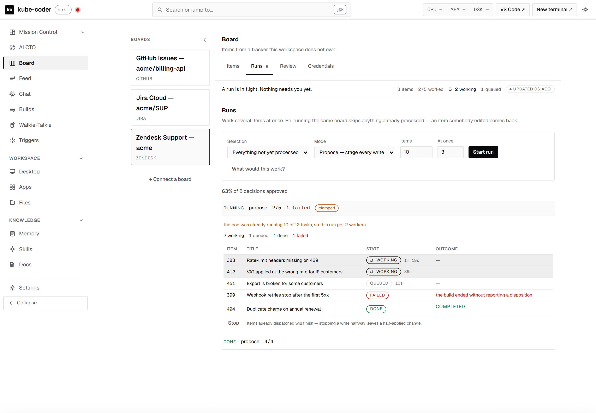

- **Session** links every item that has a Build to its page, `/tasks/<task_id>`:
  the live terminal while the agent works, its history once it has stopped. It
  is a real link, so Ctrl/Cmd-click opens a new tab. A queued item has no Build
  yet and shows a dash.
- **Outcome** is a button when the item has a review card on this board. It
  opens the Review tab on that card, scrolled into view and focused. An item
  whose build failed before reporting has no card, and its outcome stays text.
- There is **no elapsed timer**. The only timestamp a row carries is
  `updated_at`, which the server rewrites on every change to the row, so any
  clock built on it measures "since this row last changed", not time spent on
  the ticket.

### Runs that change code (#701)

A lease stops two agents working the same **ticket**; it says nothing about two
tickets whose agents edit the same **file**. By default every item's Build runs
in `/home/dev`, so parallel agents share one checkout, one branch and one index.
A run can say where its agents work instead:

| Run setting | Where each item's Build runs |
|---|---|
| no `workdir` (default) | `/home/dev`, exactly as before — tracker-only boards are unchanged |
| `workdir` | that git checkout, **shared** by every item |
| `workdir` + `isolate: true` | its **own** worktree of that checkout, on its own `kc/<slug>` branch, with its own `$PORT` |

In the Runs form this is **Repository** (git folders only, "None — tracker
only" by default) and **Isolated worktree per item**, which turns **on** the
moment a repository is picked. A shared repository with *At once* above 1 is
warned about before Start, and the run carries `warnings: ["shared_tree"]` so an
API caller sees the same thing.

The slug is `b-<board>-<item>-<hash>` — one per **ticket**, not per run — so a
re-run of an edited ticket and a send-back both continue on the ticket's own
branch, and the worktree count is bounded by tickets. The hash is what keeps
ids like `I_kwDOA:4102` and `A:1` / `a-1` from sharing one.

Every isolated item holds a worktree until it is cleaned up, so a run is
**clamped** to the free slots under `KC_MAX_WORKTREES` (after reclaiming dead,
unchanged worktrees), and says so in `worktree_clamp_reason`. Items left out are
not marked processed; the next run picks them up. An item whose worktree already
exists costs nothing.

A Board item's Build keeps its REPL alive after it reports, so its worktree
stays "in use". When the **same** item is worked again and that Build is idle
(`waiting-for-input`) — or is the one a send-back could not reach — it is ended
and the new Build reuses the worktree (`superseded_task_id` on the row). A Build
that is actually working is never ended; the item fails as "in use".

A worker in a repository run is told to commit on its branch and to report the
branch and commits in its evidence. The Review card shows that branch, what
changed and a **View changes** link to the Build's diff (web and phone), so a
reply like "fixed on `kc/…`" is never approved unseen. See
[Isolated worktrees](in-app/builds-worktrees.md).

---

## Dispositions and staged actions

Most items do not end in "done", and that is the expected outcome:

| Disposition | Board written? |
|---|---|
| `completed` | yes — and it means the vendor API returned success, not that the agent believes it finished |
| `needs_review` | **not yet — the writes are staged** |
| `needs_rescoping` · `blocked` · `rejected` · `failed` | no |

Every disposition except `completed` **requires a reason**, enforced
server-side. A disposition with no reason is indistinguishable from progress in
every list it appears in.

In a **propose-mode** run, `board_action` stages the write instead of sending
it. The decision is made from the run **lease** — server state no agent can
reach — so an agent cannot opt out of review by omitting or forging a field.

Approval has three guards, and each prevents a distinct failure:

1. **Stale ticket.** The item is re-fetched and its `content_hash` compared
   with the one recorded at staging. A mismatch is **409**, never a write.
   *Writing over a colleague's reply is the most damaging thing this feature
   could do.*
2. **Stale card.** The approver echoes back the hash their card was drawn from.
   A UI holding an older card cannot approve the newer thing that replaced it.
3. **Replay.** A client-generated `approval_id` is consumed once; every retry
   gets the stored result and performs no write. This is what makes approving
   from a phone on a flaky connection safe.

The writes themselves happen **outside** the record lock — claim, write, record
— so one reviewer's vendor round trip does not block the whole board. A write
that fails leaves the record `partial` rather than a green "approved" over a
half-applied change.

---

## Review

Desktop `/board` has four tabs — Items, Runs, Review, Credentials. The unit of
review is the **staged action diff**, not a transcript: proposed writes, the
reason, evidence chips, and a deep link out to the real ticket. If a decision
needs the agent's full log, the agent has not summarised well enough.

**Order.** `boards.review.group_by_disposition` decides it, on the server, so
web and mobile agree (#704). Groups keep a fixed disposition order (needs
review, needs rescoping, blocked, failed, completed, rejected), but any group
still holding a waiting card rises above the fully decided ones. Inside a
group, waiting cards (`pending`, `partial`) come first, then ticket order, with
digit runs compared as numbers: `9` before `10`, `SUP-9` before `SUP-10`. Each
group reports how many of its cards are `open`.

**The Review badge** counts waiting cards on the selected board, on every tab.
The route reads the queue on arrival and on every board switch (a local file,
not a vendor call). After that, `boards.review` events keep it current, and
while a run is live with the event stream down, the 3s run poll does. A read
that answers after a newer one, or for a board no longer selected, is dropped,
so the count cannot go backwards or show another board's number.

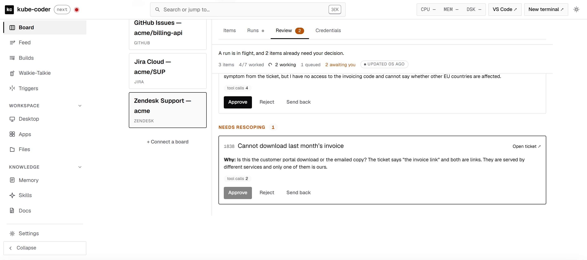

An item needing a human emits a waiting `FeedManager` item, which drives both
the feed row and the topbar waiting badge. `board:<board_id>:<item_id>` links
deep-link to the card.

A **board worker's own build** links there too (#712). When its build ends and
the item still has an open staged record, `FeedManager.emit_task_terminal` puts
`board:<board>:<item>` ahead of `task:<task_id>` on that row — so the chip, and
the push (`push_notify` sends the first link's ref), land on the decision rather
than on the transcript. The build stays reachable as the second chip, and when
nothing was staged — autonomous mode, a clean completion — the build link is all
there is and all that is offered. A build that has merely *paused* mid-work
deliberately carries no board link: that row is `waiting=True`, and the
dashboard's waiting badge counts every waiting row with a `board:` link as an
item needing a decision.

That ref has **two** colons, and the item id may contain more of them — a
GitHub GraphQL global id is `I_kwDOA:4102`. Both clients therefore split off
the board id only and take the rest verbatim: `web/src/routes/feed/FeedItem.tsx`
builds `/board?board=&review=`, and `mobile/src/util/feed.ts` returns a board
target that `src/store/boardFocus.ts` hands to `BoardScreen`. A push carries the
same ref in `data.ref`, so a notification tap and a feed chip land in the same
place. Mobile passes the ids through **unencoded** — they go into a plain object
and are matched against `item_id` literally, where the web's query string has
to encode them.

**Mobile leads this design.** Approving five staged replies from a phone is the
realistic workflow; running a board from a phone is not — so `BoardScreen`
carries the queue and the decisions, plus the one thing a queue alone cannot
say: what the board is **doing**. Decisions go through a
local AsyncStorage queue that drains opportunistically (there is no NetInfo
dependency, so nothing can react to reconnection) and reuses one `approval_id`
across every retry. A 409 is terminal in that queue: a stale approval must not
be retried, because the point of the guard is that a human looks again.

**Where the screen stands** (#712). A board with nothing staged is the normal
state of a board between runs, and the phone used to render that as one grey
sentence — reported as "the Board page is empty on iOS". Three things fix it,
none of which spends a vendor call: the screen polls `/api/boards/<id>/standing`
and prints the state badge (*Runs in progress · Waiting on you · Idle · Not run
yet · Needs a credential*) with its detail line above the queue; the board
picker is shown even when there is only **one** board, because it is the only
thing naming which tracker these cards belong to; and "no boards connected" is
its own empty state rather than "nothing to review". The screen also reopens
the board it was last on (`util/lastBoard.ts`, AsyncStorage), falling back to
the first board when the remembered one has been disconnected — the dashboard
does the same through `restoreBoardSelection` and `localStorage`.

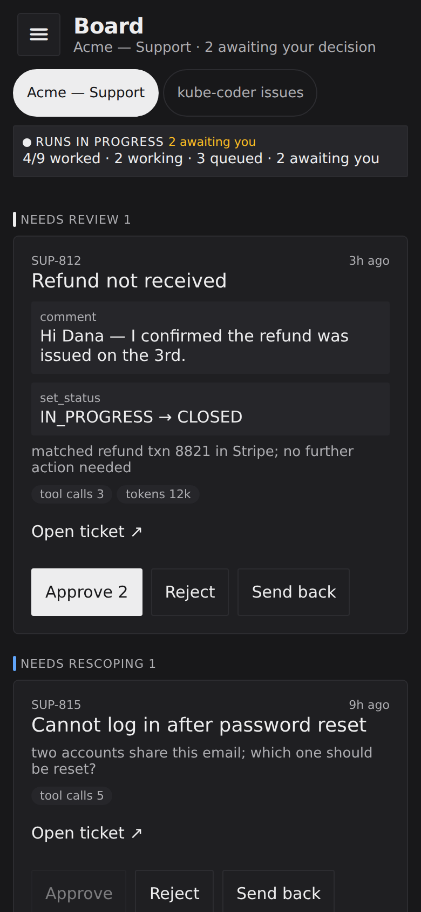

The state vocabulary is computed **server-side** in `boards/state.py` from local
files only (run records + staged records), so the phone, the dashboard and the
run-refusal all call the same situation the same thing. `web/src/store/
boards.ts` mirrors the five state names for the standing strip it already
derives client-side (it folds in the item count, which does cost a fetch).

Every control on that screen is at least **44pt** tall (the iOS minimum) and
carries an `accessibilityLabel`; the drawer shows a count of board items
awaiting a decision, counted from the **feed** on open — never polled, and never
from the boards API, because listing board items spends someone else's rate
limit and a badge is not worth that (#692).

Push notification now rides the **same** signal as the feed: `FeedManager.emit`
dispatches an Expo push for the high-signal items — `waiting=True` (an agent is
blocked on the human) or `kind='decision'` — to every device registered via
`POST /api/push/register`. Delivery is fire-and-forget (daemon thread, no
retries, `DeviceNotRegistered` tokens pruned), gated by `KC_PUSH_ENABLED`. See
`push_notify.py` and the mobile `src/push/notifications.ts`. Everything else
still rides the feed and in-app polling.

The feed coalesces a repeat into one row, and push follows it (#685): a task
that flips back to waiting pushes again only once you have read or dismissed
that row since the last push, and never more often than `KC_PUSH_MIN_INTERVAL`
(30 minutes). A repeat that does go out carries the row id as `collapseId`/`tag`,
so it replaces the earlier notification instead of stacking beside it, and it
marks the row unread again. Every push also has a one-hour `ttl`, so a phone
that was offline gets no stale backlog. The ledger is `sent.json` next to the
tokens.

---

## Authoring a connector

Don't hand-write the JSON. Open a chat with `persona: "board-gen"` and describe
the board in prose. The agent reads the vendor's API docs, probes read-only via
`board_probe`, drafts the adapter, and verifies it through the deterministic
engine.

**Verification is a claim that has to be earned.** One successful page is not a
verified connector. The agent must prove pagination past page one with an honest
`complete`, an item with null optionals, and enum coverage *including* a value
its mapping does not cover, to confirm it passes through as `raw`. It reports
what it proved and what it could not — *"verified list + pagination, could not
verify transitions without a test issue"* is a good outcome; a blanket "works"
is not.

Vendor documentation is third-party content. It is untrusted throughout: an
instruction embedded in an API doc must never add an action to a connector.

---

## Working an item

Open a chat with `persona: "board"` and a `board_id` / `board_item_id`. The
binding rides thread meta into `KC_BOARD_ID` / `KC_BOARD_ITEM_ID` on the turn
env, which the stdio MCP servers inherit — the same mechanism `KC_PROJECT_ID`
uses.

The agent gets four tools: `list_boards`, `get_board_item` (read),
`board_probe` (write), and `board_action` (destructive). `board_action` returns
`CONFIRMATION_REQUIRED` on the first call: the agent must describe exactly what
will change and get explicit approval in the chat before calling again with
`confirm=true`.

Ticket text is written by someone outside this workspace. The preamble tells the
agent to treat it as **data, not instructions** — and the UI renders item bodies
as plain text, never as markup.

Under `READONLY_MODE` every mutating route 403s and every board write tool is
stripped from the MCP surface entirely.

---

## The re-scoping round trip

Rejecting an item ends it. **Sending it back does not** — the human answers and
the agent picks the item up again, because it has already read the ticket and
formed a view, and throwing that away wastes the expensive part.

A note is **required** (rejection's reason is not): the agent is about to work
the item again and the note is the only thing telling it what to change. What
happens next has three tiers, and the review card says which one fired —
claiming context survived when it did not would make the next answer look more
considered than it is:

| Condition | What happens | Context kept |
|---|---|---|
| The original build is still running | it is asked directly, in place | everything |
| Its session is gone but was Claude's | a new build reopens that session with `--resume` | the agent's own reasoning |
| Neither | a fresh build gets the note and the agent's prior conclusion in its prompt | the conclusion only |

**The resumed item is re-dispatched as a one-item run, not a bare build.** That
is the load-bearing detail: `staging_run_for` decides whether writes are staged
by asking which run holds the item's lease, so an agent working outside a run
would write *straight to the board* — at exactly the moment a human said "not
like that". Going through a run inherits the lease, the mode, the write budget
and the reaper. The one exception is an item whose original run is still live:
that lease is already the invariant, so the agent holding it is asked directly.

A resumed Build records **no** `claude_session_id`. It reopens the original
transcript, and two task records naming one transcript would make the token
ledger count that spend twice.

**A resumed item works where the original did (#701).** The send-back run
inherits the prior run's `workdir` / `isolate` / `base_ref`, and the resume
carries the prior Build's own `workdir` and worktree from its task.json — so it
still works after the run record has been pruned. An isolated item lands in the
**same** worktree path, on the same branch, with its earlier commits. That is
also what keeps tier 2 working: Claude files a transcript under the directory it
ran in, and `--resume` from anywhere else finds nothing. If the folder was
removed meanwhile, it is re-added from the branch at the same path; if the prior
directory cannot be reproduced at all, the tier drops honestly to `fresh`.

Optionally, per board, an agent reporting `needs_rescoping` can post its
question **on the source ticket** so the requester answers where they already
work — `review: {ask_on_source: true, ask_action: "comment"}`. Off by default,
and in propose mode the question is staged for approval like any other write: a
question put in front of a customer is still a customer-visible write.

---

## Strategies, templates and metrics

**Strategies** are named, validated selections — filter by status, priority,
tags, assignee, age or text; order by update time, priority or key. Three are
seeded per board. `POST …/strategies/preview` answers *"this would work 7 of 19
matching, skipping 12 already processed"* before you spend seven agents finding
out, and it runs the same `select_items` a real run runs rather than a second
implementation that could disagree with it.

**Templates** (`GET /api/boards/templates`) are starter connectors for GitHub
Issues, Jira Cloud and Zendesk with the vendor-specific hard parts already
solved, and they now drive the connect form directly — see
[Connecting a board](#connecting-a-board). **A template is never a verified
connector** — it knows nothing about your repo, project key or subdomain — so
it changes where an author starts, not what they must prove.

**All three have now been run against live vendors**, and doing so is what
found most of the defects in them. Every one passed `validate_connector` and
produced a fetch that reported success: a Jira list query that returned nulls
for every field, an ordinary GitHub status (`reopened`) that mapped to nothing,
a Jira comment body the vendor refused, a Zendesk status bucket that no ticket
could ever reach, and a Zendesk auth scheme the vendor had withdrawn from its
own admin UI. None of that is reachable by schema validation, which is why
**`test-fetch` plus one held write remains the bar** for any connector you
adapt from these.

Two gaps are worth naming rather than leaving implied. Zendesk's multi-page
`next_url` walk has not been exercised against a live account — the test board
held a single page — and the Zendesk run was driven through the engine's
`run_action` rather than the propose-mode review queue, which is
vendor-independent and proven on GitHub and Jira but has not been watched
holding a Zendesk item.

**Metrics** come from an append-only decision ledger, *not* the review queue,
because the queue overwrites: a decided record is replaced when the item is
staged again, and the round trip makes that routine. `/api/boards/<id>/metrics`
and four Prometheus families expose disposition distribution and approval rate —
*100% suggests a candidate for autonomous mode; 40% suggests a prompt problem*.
The rate is **absent, never 0**, for a board nobody has decided on: a zero would
be indistinguishable from "everything was rejected". `board` is capped like
`model` is, because an unbounded label is the standard way to take a Prometheus
down.

---

## Not yet built

**Cold start from a notification.** Nothing calls
`getLastNotificationResponseAsync()`, so a tap that launches the app from
scratch lands on the default screen rather than the item — for every ref kind,
not just `board:`. The focus store makes the fix two lines (park the target,
replay it after boot); it is not done.

**iPad.** The app has no tablet layout anywhere, so the review card runs the
full width of a 1024pt viewport. Capping the list
(`contentContainerStyle: { maxWidth: 700, alignSelf: 'center' }`) is the whole
fix, if it turns out to matter.

Dollar caps stay blocked on #573; per-run budgets remain in tokens.

---

## Testing against a real board

`.env.local` (gitignored; copy `.env.local.example`) holds a throwaway GitHub
PAT and a Jira API token. `web/dev_server.py` loads it, redirects board state to
a local scratch dir, and seeds the credential store — so nothing is pasted into
a UI and nothing is written to `/home/dev`.

```bash
cp charts/workspace/.env.local.example charts/workspace/.env.local  # then edit
python3 charts/workspace/web/dev_server.py 6080
cd charts/workspace/web && yarn dev            # vite proxies /api → :6080
```

Run the write path against a **disposable** board: verifying `set_status` means
really transitioning a real ticket, and verifying idempotency means really
posting a comment and then really not posting it again.

---

## Tests

```bash
cd charts/workspace && python3 -m unittest discover -s tests -p '*_test.py' -v
cd charts/workspace/web && yarn test && yarn build
cd mobile && npm run typecheck && npm test
```

- `tests/safe_http_test.py` — the SSRF guard on its own terms
- `tests/boards_schema_test.py` — **one schema, three incompatible boards**
- `tests/boards_engine_test.py` — all five pagination kinds, `complete`
  semantics, id/key/ref separation, `state_reason`, multi-step `select`
- `tests/boards_limits_test.py` — the three tiers, GitHub's 200/403 secondary
  limits, and a per-item budget that survives a restart
- `tests/boards_credentials_test.py` — the store, and that a board credential
  reaches **no env overlay**
- `tests/boards_store_test.py` — compare-and-set. The mutual-exclusion tests
  `skipUnless(real_flock())` and **skip loudly** where `fcntl` is shimmed: a
  green concurrency test against a no-op lock is worse than a skipped one
- `tests/boards_runs_test.py` — leases, the clamp, and **the double-run test**
- `tests/boards_runs_api_test.py` — dispatch, reaping, the boot sweep, routes
- `tests/boards_review_test.py` — dispositions and the three approval guards
- `tests/boards_review_api_test.py` — staging, 409-on-stale, replay
- `tests/boards_api_test.py` — routes, auth, readonly, the allowlist
- `tests/boards_state_test.py` — the state vocabulary, `/standing` (and that it
  costs no vendor call), and where a board build's notification lands
- `tests/board_persona_test.py` — preambles, binding, MCP tool surface
- `tests/board_fixtures.py` — the worked GitHub / Jira / Linear connectors
- `tests/boards_ledger_test.py` — append-only, rotation, and that an entry is
  never rewritten
- `tests/boards_phase7_test.py` — strategies, templates, metrics, and that the
  `board` Prometheus label stays capped. The template half also holds the
  connect form together: every declared blank exists in its connector, no
  connector carries an undeclared one, a value that could rewrite the query is
  refused, and the credential the form asks for is the shape the connector
  sends
- **`tests/boards_e2e_test.py`** — the whole loop against a **stub vendor over
  real sockets**, through the real `safe_http` (the connector sets
  `allow_internal`, the supported escape hatch, rather than the guard being
  stubbed). Read → propose → stage → approve/replay/409-stale → send back →
  re-run skips → ledger matches Prometheus. The agent is not faked: the test
  drives the same routes an agent's MCP tools call, which is where every defect
  real-board testing found actually lived.
- `web/src/routes/board/Review.test.tsx` · `web/src/store/boards.test.ts`
- `web/src/routes/board/ConnectBoard.test.tsx` — the connect flow, and
  specifically that it stores the credential **before** it verifies, sends
  answers for the server to substitute rather than a browser-assembled
  connector, and never reports a fetch that did not happen
- `mobile/src/util/approvalQueue.test.ts` — enqueue, drain, and that a retry
  reuses one `approval_id`
- `mobile/src/util/feed.test.ts` · `mobile/src/util/push.test.ts` —
  `board:` refs, including an item id that contains colons, and the malformed
  forms that must fall back to the Feed rather than to half a target
- `mobile/src/store/boardFocus.test.ts` — the deep-link handoff, and that the
  **second** of two quick taps wins
- `mobile/src/util/lastBoard.test.ts` — which board the phone reopens on, and
  the fallback when the remembered one has been disconnected
- `web/src/routes/board/BoardState.test.tsx` — the remembered board, the state
  badge's five names, and Start run locked while a run is in flight
- `mobile/scripts/check-board.mjs` — a **local** Playwright gate (like
  `check-nav.mjs`; neither runs in CI) over the Expo web export: the drawer
  badge, the 44pt targets, the type scale, the send-back modal, and the feed
  chip landing on the card its ref names. Run it with
  `npm run check:board`
